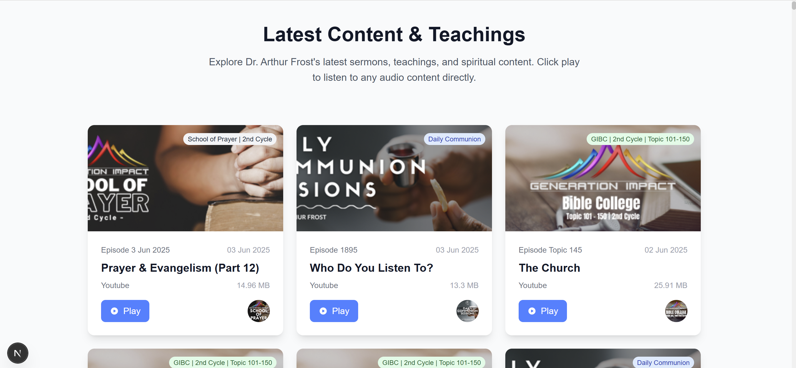

# Dr. Arthur Frost Timeline - CRG Assessment

A React application that displays Dr. Arthur Frost's timeline of teachings, sermons, and spiritual content. Built with Next.js, TypeScript, and Tailwind CSS.

## Features

- **Timeline Display**: View all of Dr. Arthur Frost's content in a beautiful card-based layout
- **Audio Playback**: Click play buttons to listen to audio content directly in the browser
- **Category Organization**: Content is organized by category (Daily Communion, GIBC Topics, etc.)
- **Responsive Design**: Fully responsive design that works on desktop, tablet, and mobile
- **About Section**: Rich content section with background images and proper typography
- **Modern UI**: Clean, modern interface with smooth animations and transitions

## Technology Stack

- **Next.js 15** - React framework with App Router
- **TypeScript** - Type safety and better development experience
- **Tailwind CSS** - Utility-first CSS framework
- **Axios** - HTTP client for API requests
- **React 19** - Latest React features

## Getting Started

### Prerequisites

- Node.js (v18 or later)
- npm

### Installation

1. Clone the repository:
```bash
git clone <repository-url>
cd crg-assessment-slm
```

2. Install dependencies:
```bash
npm install
```

3. Run the development server:
```bash
npm run dev
```

4. Open [http://localhost:3000](http://localhost:3000) in your browser to see the application.

## Available Scripts

- `npm run dev` - Start development server
- `npm run build` - Build for production
- `npm run start` - Start production server
- `npm run lint` - Run ESLint

## API Integration

The application fetches data from:
- **Timeline Data**: `https://arthurfrost.qflo.co.za/php/getTimeline.php`
- **Images**: `https://arthurfrost.qflo.co.za/Images/`
- **Audio Files**: `https://arthurfrost.qflo.co.za/MP3/`

## Project Structure

```
src/
├── app/
│   ├── layout.tsx          # Root layout with metadata
│   ├── page.tsx            # Main page component
│   └── globals.css         # Global styles
├── components/
│   ├── Timeline.tsx        # Timeline card grid component
│   ├── AboutSection.tsx    # About section with background
│   ├── Header.tsx          # Navigation header
│   ├── Footer.tsx          # Site footer
│   └── LoadingSpinner.tsx  # Loading state component
└── types/
    └── timeline.ts         # TypeScript type definitions
```

## Key Features Implemented

### 1. Timeline Cards
- Clean card-based layout with images, titles, and metadata
- Category badges with color coding
- Audio file size display
- Episode numbers and dates

### 2. Audio Playback
- Native HTML5 audio with play/stop functionality
- Visual feedback for currently playing audio
- Automatic cleanup when switching between tracks

### 3. About Section
- Rich HTML content rendering with `dangerouslySetInnerHTML`
- Background images with opacity overlays
- Responsive typography with prose classes

### 4. Error Handling
- Graceful error handling for API failures
- Image fallbacks for broken images
- Loading states and error messages

### 5. Responsive Design
- Mobile-first responsive grid layout
- Optimized for various screen sizes
- Touch-friendly interface elements

## CRG Assessment Requirements ✅

- ✅ Single React page displaying JSON content
- ✅ Ajax call to fetch timeline data from provided endpoint
- ✅ Display of images from the specified image directory
- ✅ Audio playback from the MP3 directory
- ✅ Modern look and feel with intuitive functionality
- ✅ Responsive design for all devices

## Build and Deployment

To build for production:

```bash
npm run build
npm run start
```

The application will be built into the `.next` folder and can be deployed to any hosting platform that supports Next.js applications.

## Screenshot



*The application displays a modern timeline interface with cards for each piece of content, featuring images, audio playback, and category organization.*

---

**Built for CRG Assessment June 2025** 💜
